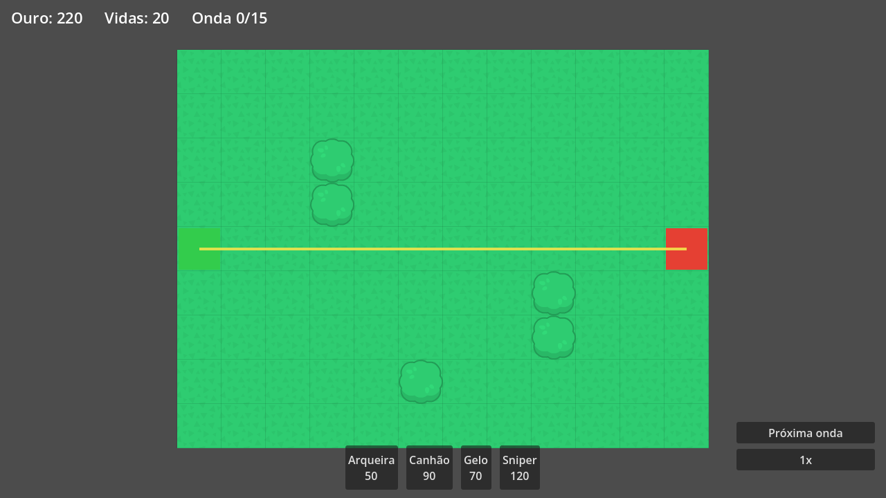

# Maze Defense

Tower defense estilo labirinto (mazing) feito em **Godot 4** com GDScript.

O jogador constrói torres numa grade aberta para formar labirintos — os inimigos recalculam a rota (A*) a cada construção. 3 mapas, 4 torres com upgrades, 4 tipos de inimigos + bosses.

## Status

**Jogável de ponta a ponta**: 3 mapas desbloqueáveis, 52 ondas, save local, áudio e arte CC0. Veja o [documento de design](GAME_DESIGN.md).

## Como jogar

- Abra o projeto no Godot 4.6+ e rode (`F5`), ou `godot --path .`
- Clique numa torre da barra (ou teclas 1-4) e clique na grade para construir o labirinto
- A célula fica vermelha se a construção bloquear o caminho — isso é proibido
- `Espaço` chama a próxima onda (antes da hora = bônus de ouro), `F` muda a velocidade, `Esc` pausa
- Vender torres (70% de volta) para reconstruir o labirinto durante a onda faz parte do jogo

## Stack

- Godot 4 + GDScript (tipagem estática)
- Plataforma: Desktop (Windows/Linux)
- Arte e áudio: assets CC0 (Kenney.nl)
- UI em português (pt-BR)
